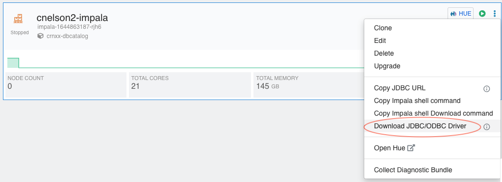
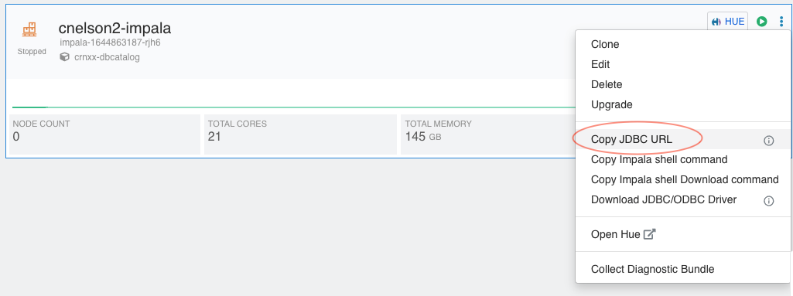
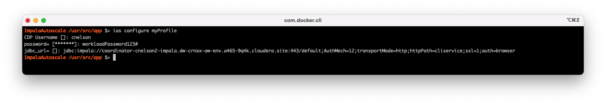
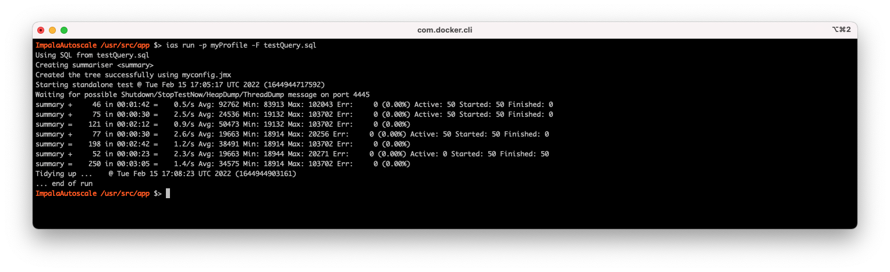
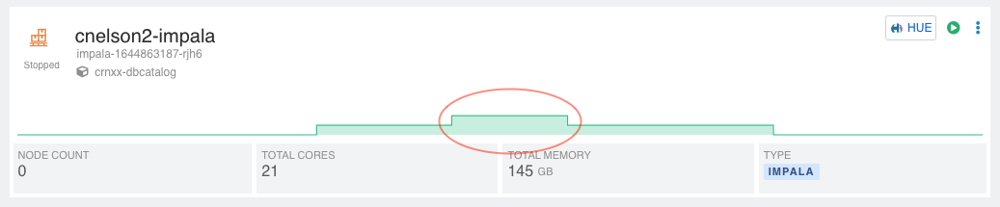

# Impala Autoscale/Load Test with JMeter

## Background

This is based on an article by Ryan Jendoubi for load testing Impala with JMeter
https://cloudera.atlassian.net/wiki/spaces/person/pages/2211938365/How+to+set+up+for+load+testing+with+JMeter

It requires installing JMeter and OpenJDK8 which you may or may not want to do on your local machine.   This will build a docker container with all the fixins to run the load test routine as explained in the above link.  It also allows for multiple Impala configurations so you can load test different Impala VDWs and switch between them easily.  The SQL to be executed is also parameterized via command line arguments or supplying a file with the query to be run.

The general idea is that from within the container, you will create execution "profiles" that contain your CDP username/password and the JDBC URL to Impala.  Multiple profiles are supported, and can be specified at runtime.  At runtime, a specified query will be executed a number of times and progress will be shown on the console.  Visually, the CPU graph on the CDP Virtual Data Warehouse will also show an increase in CPU during the test.

The command line tool `ias` is part of this install, and `ias help` or `ias <command> help` are there to provide (minimal) guidance.

## Prerequisites

### Docker
You should already have Docker installed, the internet has many resources detailing how to install it on your particular OS.

### Impala
This assumes you already have an Impala virtual data warehouse running in CDP.  _Instructions on this prereq can be found in the CDP Data Warehouse Lab (not yet available)._

### Data/Queries
The premise here is that you have a warehouse with data & tables and you want to use this tool to load test it using your own SQL.  There is an appendix at the end of this document which provides links to some datasets, DDL, and SQL to load test with.  

---
## Installation

### Clone the repository
Clone the repo to your local machine:

```
git clone https://github.com/supahcraig/ImpalaAutoScale.git
cd ImpalaAutoScale
```


### Download the Impala JDBC jar
* From your Impala virtual warehouse, download the ODBC JDBC driver, which will be named `impala_driver_jdbc_odbc.zip` _(see image below)_
* unzip it, which will unzip into two additional zips: `ClouderaImpalaODBC-2.6.13.1015` and `ClouderaImpala_JDBC-2.6.23.1028` _(version numbers subject to change)_
* unzip ClouderaImpalaJDBC42-2.6.23.1028.zip _(version numbers subject to change)_, which will produce `ImpalaJDBC42.jar`
* Copy `ImpalaJDBC42.jar` to the root level of the repository you just cloned, as it will be copied into the container image at build time.




### Run the container
Run this command to build the container that will host the JMeter execution.  Once complete it will drop you into the shell for the container.   Exiting the container will stop the running container.

```
chmod +x ./quickstart.sh
./quickstart.sh
```
---
## Usage 

ImpalaAutoScale works by configuring execution profiles in `.impala_autoscale.conf` through a configuration utility.   The execution profile is then specified at runtime, making it simple to execute loads against various Impala instances.  A profile consists of your CDP username, workload password, and a JDBC URL.


### Configure Profiles
You can create multiple profiles and specify which you want to use at runtime when you execute the loadtest.  You will be prompted for your CDP username, workload password, and the JDBC URL.   The JDBC URL can be found in the dropdown on your virtual warehouse or within Cloudera Manager, and should look similar to this:



`ias configure <profile name>` where `<profile name>` is whatever you want to name your execution profile.

```
jdbc:impala://coordinator-cnelson2-impala.dw-environment-name.a465-9q4k.cloudera.site:443/default;AuthMech=3;transportMode=http;httpPath=cliservice;ssl=1;auth=browser
```



If is necessary to tweak an execution profile, you can simply re-run `ias configure` for that profiles.  It is also possible to manually edit the `.impala_autoscale.conf` using vim if so desired.


### List Profiles
To list the currently stored profiles use the `ls` command

`ias configure ls`


### Running the load test
To run the load test you must specify an execution profile and a query to execute.  The query can be supplied as a command line argument directly, or as a file containing your query.

At runtime, a boilerplate JMX file is modified to include the username/password/JDBC URL/SQL from the specified profile and query and saved as `myconfig.jmx`  Once the new jmx file is created, `run` will initiate the JMeter execution and put the output into `./resultsfile` and also into a new folder called `./output`.  Subsequent runs will remove those two artifacts before execution. 

`ias run -p <profile> -F <SQL file>`

or...

`ias run -p <profile> -s <SQL statement>`


---
## Results

While the test is running, evidence should be visible in the CDP Virtual Data Warehouse tile.  For a sufficiently complicated query & large enough dataset it is possible to see a scale-up event.





And you're done!   You can re-run the test, modify the query, point to a different Impala instance...or exit, which will stop the container.

---


## Troubleshooting

If you see 100% errors, check `resultsfile` for specifics on the errors.  The most common issues results in a 401 or 503 response from the server.
* This is likely an incorrect workload password
* The AuthMech in your JDBC URL may need to be changed from `12` to `3` in order to authticate 
* In some cases simply re-setting the workload password in CDP (and then updating your ias execution profile) has been observed to correct the issue


---
## Appendix

Finding enough data with a complex enough query to make it autoscale is the real challenge here.  I had success with a baseball data set that includes some Pitch F/X data and was able to build a query with a couple of correlated subqueries to make Implala show a scale up event.  Kaggle has a large amount of free datasets, some of which may be useful for this sort of exercise.

[MLB Dataset from kaggle](https://www.kaggle.com/pschale/mlb-pitch-data-20152018)

DDL & queries for that dataset will be presented in a subsequent lab & linked here once available.

