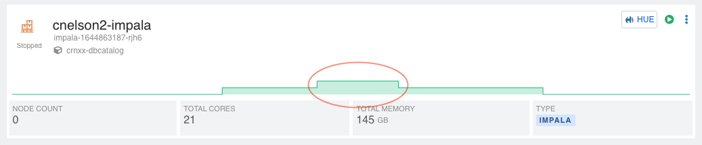

# Impala Autoscale with JMeter

This is based on an article by Ryan Jendoubi for load testing Impala with JMeter
https://cloudera.atlassian.net/wiki/spaces/person/pages/2211938365/How+to+set+up+for+load+testing+with+JMeter

It requires installing JMeter and OpenJDK8 which you may or may not want to do on your local machine.   This will build a docker container with all the fixins to run the load test routine as explained in the above link.  It also allows for multiple Impala configurations so you can load test different Impala instances (with different users) and switch between them easily.  The SQL to be executed is also parameterized via command line arguments or supplying a file with the query to be run.

---
## Installation

### Clone the repository
Clone the repo to your local machine:
`git clone https://github.com/supahcraig/ImpalaAutoScale.git`


### Download the Impala JDBC jar
* From your Impala virtual warehouse, download the ODBC JDBC driver, which will be named `impala_driver_jdbc_odbc.zip`
* unzip it, which will unzip into two folders: `ClouderaImpalaODBC-2.6.13.1015` and `ClouderaImpala_JDBC-2.6.23.1028` _version numbers subject to change_
* Inside the `JDBC` folder is `ImpalaJDBC42.jar`; this needs to be in the repository folder, as it will be copied into the container image at build time.

[Virtual data warehouse dropdown for copying JDBC URL](copy-jdbc-url.png)


### Run the container
Run this command to build the container that will host the JMeter execution.  Once complete it will drop you into the shell for the container.   Exiting the container will stop the running container.

```
chmod +x ./quickstart.sh
./quickstart.sh
```
---
## Usage

ImpalaAutoScale works by setting up profiles in `.impala_autoscale.conf` through a configuration utility.   Multiple profiles are supported and then specified at runtime, making it simple to execute loads against multiple Impala instances.

### Configure Profiles
`ias configure <profile>`

You will be prompted for your CDP username, workload password, and the JDBC URL.   The JDBC URL can be found in the dropdown on your virtual warehouse or within Cloudera Manager, and should look similar to this:

```
jdbc:impala://coordinator-cnelson2-impala.dw-environment-name.a465-9q4k.cloudera.site:443/default;AuthMech=3;transportMode=http;httpPath=cliservice;ssl=1;auth=browser
```

It is possible to manually edit the `.impala_autoscale.conf` using vim if you need to tweak the JDBC URL.

### List Profiles
`ias configure ls`

This will list all the currently stored profiles.


### Running the load test
`ias run -i <profile> -F <SQL file>`

or...

`ias run -i <profile> -s <SQL statement>`

To run the load test you must specify a profile to use and a query to execute.  The query can be supplied as a command line argument directly, or as a file containing your query.

At runtime, a boilerplate `config.jmx` file is modified to include the username/password/JDBC URL/SQL from the specified profile and query and saved as `myconfig.jmx`  Once the new jmx file is created, `run` will initiate the JMeter execution with this command (it will run it for you), and put the output into `./resultsfile` and also into a new folder called `./output`.  Subsequent runs will remove those two artifacts before execution.

`HEAP="-Xms1g -Xmx1g -XX:MaxMetaspaceSize=256m" CLASSPATH=$(pwd) ./apache-jmeter-5.4.3/bin/jmeter -n -t myconfig.jmx -l ./resultsfile -e -o output`

## Results

While the test is running, evidence should be visible in the CDP Virtual Data Warehouse tile.  For a sufficiently complicated query & large enough dataset it is possible to see a scale-up event.



---
## Appendix

Finding enough data with a complex enough query to make it autoscale is the real challenge here.  I had success with a baseball data set that includes some Pitch F/X data and was able to build a query with a couple of correlated subqueries to make Implala show a scale up event.  Kaggle has a large amount of free datasets, some of which may be useful for this sort of exercise.

[MLB Dataset from kaggle](https://www.kaggle.com/pschale/mlb-pitch-data-20152018)

